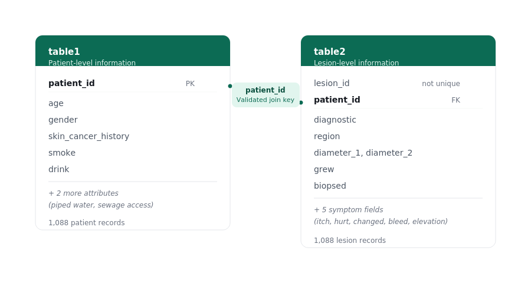
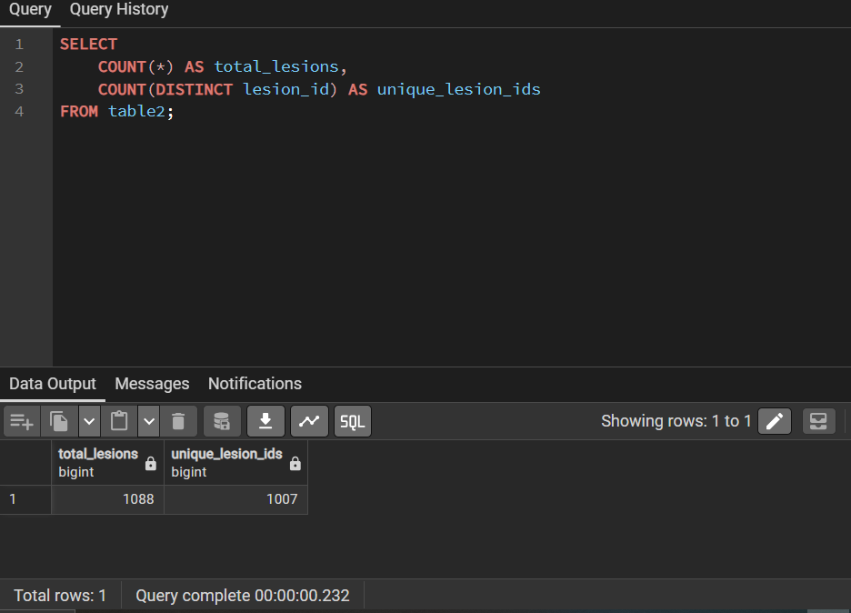
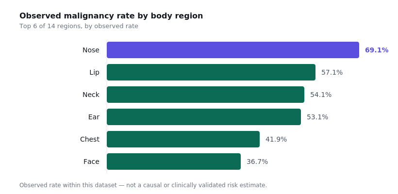
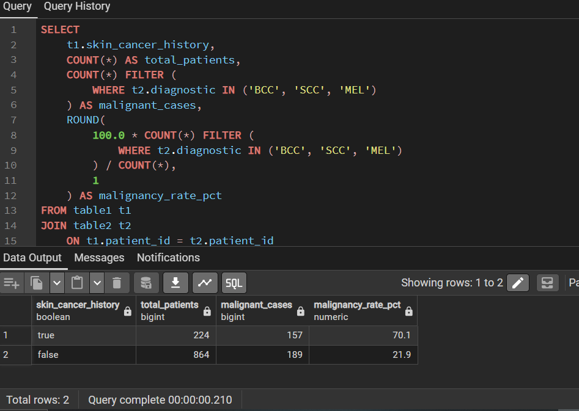

# DORI Skin Cancer Risk Intelligence

A PostgreSQL analysis of 1,088 patients and their skin lesion records, exploring which
demographic, clinical, environmental and lifestyle factors were associated with malignant
diagnoses.

**Live case study:** https://marianohwerhi.github.io/portfolio-website/case-studies/dori-skin-cancer-risk-intelligence.html

---

## Project Overview

This project uses SQL against a two-table PostgreSQL database to validate the underlying
data, then explore a series of demographic, clinical, environmental and lifestyle questions
related to malignant skin cancer diagnoses, before summarising the findings into
practical, evidence-informed considerations for screening.

## Business Problem

The analysis explored which demographic, clinical, environmental and lifestyle
characteristics were associated with malignant skin cancer diagnoses, with the aim of
identifying patterns that could help inform screening priorities.

## Dataset

- **1,088 patients** and **1,088 lesion records**, related through `patient_id`
- **6 diagnostic categories**: BCC, SCC, MEL (malignant); ACK, NEV, SEK (non-malignant)
- **346 malignant diagnoses (31.8%)** of the total dataset
- Two tables:
  - `table1` — patient-level: `patient_id`, `age`, `gender`, `skin_cancer_history`, `smoke`,
    `drink`, `has_piped_water`, `has_sewage_system`
  - `table2` — lesion-level: `lesion_id`, `patient_id` (FK), `diagnostic`, `region`,
    `diameter_1`, `diameter_2`, `grew`, `biopsed`, plus symptom flags (`itch`, `hurt`,
    `changed`, `bleed`, `elevation`)



## Data Quality & Validation

Before any analysis, the following checks were run (full queries in `sql/dori_skin_cancer_analysis.sql`):

| Check | Result |
|---|---|
| `lesion_id` global uniqueness | 1,088 total vs 1,007 distinct — `lesion_id` was not globally unique despite being described as unique in the data documentation |
| Duplicate `patient_id` in `table2` | 0 rows — each patient has exactly one lesion record |
| Orphan `patient_id` in `table2` | 0 rows — every lesion maps to a real patient |
| NULLs in key `table1` fields (age, gender, skin_cancer_history) | 0 across all three |
| NULLs in key `table2` fields (diagnostic, region, diameters, grew, biopsed) | 0 across all |
| Duplicate `patient_id` in `table1` | 0 rows |
| Inconsistent casing/whitespace in `region`, `diagnostic` | None found |

Because `patient_id` maintained a validated one-to-one relationship between the tables, the
analysis used `patient_id` for joins throughout and did not rely on `lesion_id` as a unique
key.



## Analytical Approach

The analysis moved through four areas: patient demographics, clinical/lesion
characteristics, environmental factors, and lifestyle factors. Within each, both raw counts
and rates were calculated where relevant, since they answer different analytical questions
(see Key Findings below for a worked example).

## Key Findings

- **Previous skin cancer history**: 70.1% observed malignancy rate (documented history) vs
  21.9% (no history) — the strongest observed association in the dataset.
- **Lesion growth**: 50.8% observed malignancy rate for growing lesions vs 15.1% for stable
  ones.
- **Lesion diameter**: MEL recorded the highest average diameter (14.09mm), followed by SCC
  (10.46mm) and BCC (9.97mm), against 2.62mm and below for non-malignant categories.
- **Body region**: Nose recorded the highest observed malignancy rate (69.1%), followed by
  lip (57.1%), neck (54.1%) and ear (53.1%).
- **Lifestyle**: Patients who both smoked and drank showed an 82.1% observed malignancy
  rate, against 70.6% (smoking only), 68.2% (drinking only), and 24.5% (neither).
- **Counts vs. rates**: The 60–74 age group had the highest number of malignant diagnoses
  (120 cases), while the 75+ group had the highest observed malignancy rate (43.9%). Counts
  describe volume; rates describe proportion — keeping them separate prevented a
  high-volume group from being misread as the highest-rate group.
- **Sanitation access**: Patients with piped water/sewage access showed higher observed
  malignancy rates than those without (~63% vs ~20%). This counterintuitive association may
  reflect unmeasured factors such as differences in healthcare access, screening or
  diagnostic follow-up, but the dataset does not establish the explanation.



All findings are observed associations within this dataset. None are presented as causal or
clinically validated.

## SQL Techniques Demonstrated

- `JOIN` across a two-table relational structure
- `CASE` expressions for demographic and lifestyle grouping
- `GROUP BY` / `ORDER BY` aggregation
- `COUNT(*) FILTER (WHERE ...)` for conditional aggregation and rate calculation
- `UNION ALL` to combine independent boolean columns into a ranked list
- Explicit `::numeric` casting for `ROUND()` compatibility with `AVG()` output
- Data-quality checks: `COUNT` vs `COUNT DISTINCT`, `LEFT JOIN` for orphan-record detection,
  NULL and duplicate checks

The full set of queries — required analysis, additional analysis, and data-quality checks —
is in [`sql/dori_skin_cancer_analysis.sql`](sql/dori_skin_cancer_analysis.sql).



## Recommendations

- Consider prioritising patients with documented prior skin cancer history for closer
  assessment.
- Lesion growth may warrant closer clinical attention as a signal worth tracking.
- Nose, lip, neck and ear lesions may warrant closer assessment regardless of size.
- Lifestyle history (smoking, drinking) could be incorporated into further screening
  evaluation.
- The sanitation-access association warrants further investigation before informing any
  decision.

## Limitations

- All findings are observational associations, not causal relationships.
- The sanitation-access finding may reflect an unmeasured factor (such as healthcare access
  or screening frequency) rather than a direct risk factor — this dataset does not
  establish the explanation.
- The dataset represents a single point-in-time snapshot; no longitudinal tracking of
  individual patients over time.
- `lesion_id` was found not to be globally unique (1,088 records vs 1,007 distinct values),
  despite being described as unique in the data documentation; it was not used as a join or
  filter key in this analysis.

## Repository Structure

```
dori-skin-cancer-sql-analysis/
├── README.md
├── sql/
│   └── dori_skin_cancer_analysis.sql
├── images/
│   ├── dori-schema.svg
│   ├── dori-schema.png
│   ├── malignancy-by-region.svg
│   ├── malignancy-by-region.png
│   ├── dori-data-quality.png
│   └── pgadmin-prior-history.png
└── report/
    └── DORI_Skin_Cancer_Analysis.pdf
```

## Portfolio Case Study

The full recruiter-facing write-up, with visuals and narrative context, is here:
https://marianohwerhi.github.io/portfolio-website/case-studies/dori-skin-cancer-risk-intelligence.html
